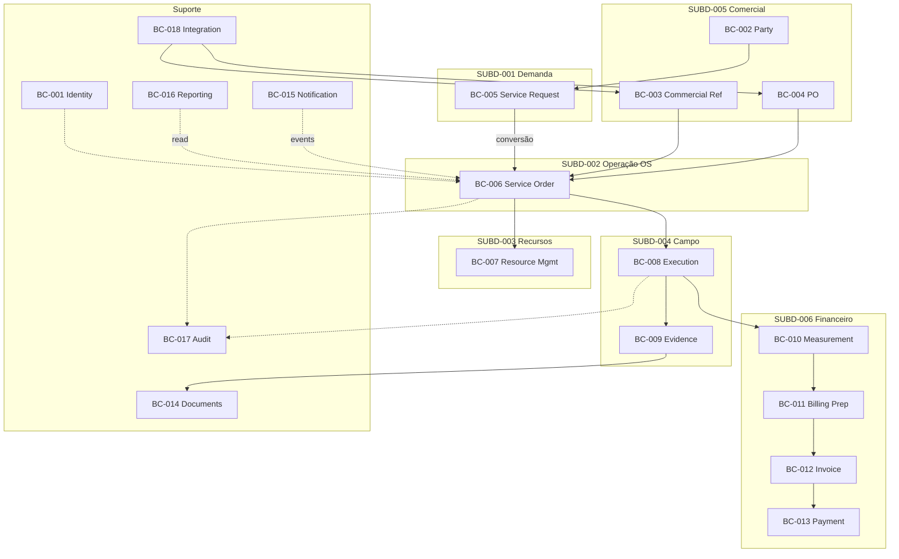

# DBND-CTX-MAP-001

| Campo | Valor |
| --- | --- |
| Document ID | Mapa de contextos candidatos |
| Prompt | 05 |

> Diagrama **candidato**. Setas indicam dependência de informação, não deploy.

Legenda: linha sólida = fluxo operacional candidato; tracejada = transversal (auditoria, leitura, auth).

Detalhamento de relações DDD: [context-relationships.md](./context-relationships.md).
