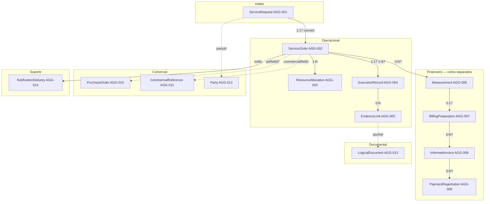

# DM-CONCEPT-001

| Campo | Valor |
| --- | --- |
| Document ID | Modelo conceitual de domínio |
| Prompt | 11 |

## Diagrama conceitual (Mermaid — relações incertas marcadas)

`?` = CARD-DDP pendente. Linhas tracejadas = referência por ID, não composição.

## Maciços rejeitados

| Maciço rejeitado | Motivo |
| --- | --- |
| OS + Medição + Faturamento | Ciclos SM separados; INV-007 |
| Solicitação + OS | EP-015; INV-001 |
| Documento + OS | BC-014 owner distinto |
| PO + OS inline | DDP-009 SoT |

## Contextos × aggregates

| BC-CAND | AGG-CAND principal |
| --- | --- |
| 005 | 001 |
| 006 | 002 |
| 007 | 003 |
| 008 | 004 |
| 009 | 005 |
| 010 | 006 |
| 011 | 007 |
| 012 | 008 |
| 013 | 009 |
| 014 | 013 |
| 004 | 010 |
| 003 | 011 |
| 002 | 012 |
| 015 | 014 |
| 016 | RM-CAND apenas |
| 017 | eventos append — não AGG mutável cliente |
| 018 | EXT-REC staging |

## Leitura

Modelo **lógico**. Persistência (Drizzle) em prompt posterior — **não** Prompt 12 nesta execução.
