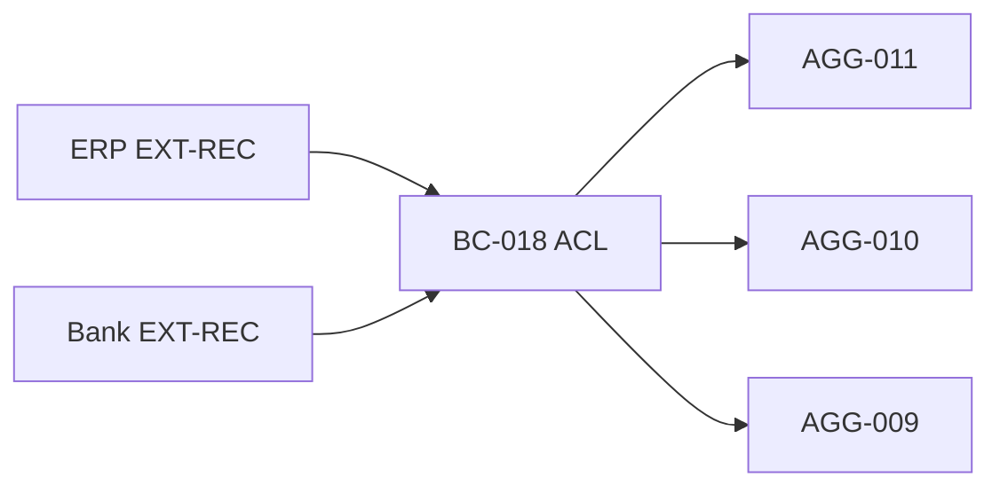

# DM-EXT-001

| Campo | Valor |
| --- | --- |
| Document ID | Modelagem referências externas |
| TERM | TERM-048, TERM-013, TERM-018 |
| Prompt | 11 |

## EXTERNAL_RECORD vs AGGREGATE

| Sistema | Modelo | Mutável localmente? |
| --- | --- | --- |
| ERP referência comercial | EXT-REC + sync → AGG-011 | Parcial via ACL |
| PO externo | EXT-REC → AGG-010? | DDP-009 |
| NF fiscal emitida fora | AGG-008 registro informado | CMD-020 |
| Pagamento banco | EXT-REC ou AGG-009 | DDP-012 |
| IdP usuário | BC-001 — fora core AGG | — |

## VO ExternalSystemId (VO-CAND-015)

```text
ExternalSystemId
├── system: (erp, bank, fiscal)
└── externalKey: string normalizada
```

## Regras

1. ID externo **não** substitui ServiceOrderId interno.
2. Mapeamento interno↔externo em BC-018 staging (ENTITY-CAND-026).
3. INV-016 — sucesso local não derivado só de ACK externo.
4. Imutabilidade silenciosa proibida — INV-022.

## Staging

ENTITY-CAND-026 StagingIntegração — estado sync; não aggregate de negócio core.

## Diagrama


