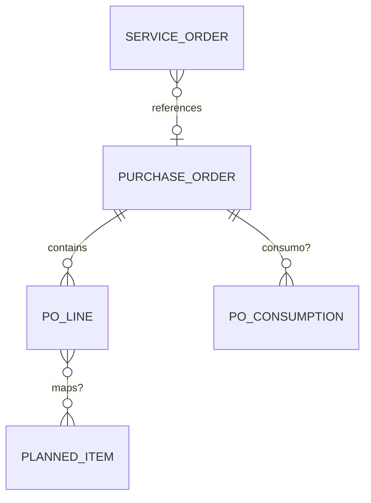

# DM-REL-001

| Campo | Valor |
| --- | --- |
| Document ID | Análise de relacionamentos |
| Prompt | 11 |

## Legenda

| Símbolo | Significado |
| --- | --- |
| `→` | Referência por ID (confirmada candidata) |
| `→?` | Cardinalidade pendente CARD-DDP |
| `—` | Sem relação direta |

## Matriz principal

| De | Para | Relação | Tipo |
| --- | --- | --- | --- |
| ServiceRequest | ServiceOrder | 1 →? 0..1 | REF |
| ServiceOrder | ItemPlanejado | 1 → 1..N | Composição |
| ServiceOrder | ResourceAllocation | 1 →? 0..N | REF |
| ServiceOrder | ExecutionRecord | 1 →? 1..N | REF |
| ExecutionRecord | EvidenceLink | 1 → 0..N | Composição leve |
| EvidenceLink | LogicalDocument | N → 1 | REF |
| ServiceOrder | Measurement | 1 →? 0..N | REF |
| Measurement | BillingPreparation | 1 →? 0..1 | REF |
| BillingPreparation | InformedInvoice | 1 →? 0..N | REF |
| InformedInvoice | PaymentRegistration | 1 →? 0..N | REF |
| ServiceOrder | CommercialReference | N →? 0..1 | REF |
| ServiceOrder | PurchaseOrder | N →? 0..1 | REF |
| ServiceRequest | Party | N → 1 | REF |
| CommercialReference | Party | N → 1 | REF |
| PurchaseOrder | ConsumoPO | 1 →? 0..N | CARD-DDP-002 |
| ItemPO | ItemPlanejado | ? | CARD-DDP-001 |

## Mermaid — PO (incerto)

## Leitura

Diagrama **conceitual** — não implica tabelas FK físicas entre schemas de módulo.
