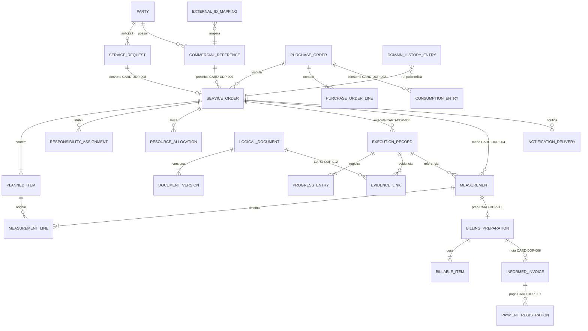

# DM-ERD-001

| Campo       | Valor                                                    |
| ----------- | -------------------------------------------------------- |
| Document ID | ERD lógico candidato                                     |
| Prompt      | 12                                                       |
| Nota        | Relações com `?` = cardinalidade **pendente** (CARD-DDP) |

## Diagrama

## Legenda cardinalidade Mermaid

| Símbolo     | Significado                   |
| ----------- | ----------------------------- |
| `\|\|--o{`  | 1:N confirmado candidato      |
| `\|\|--o\|` | 1:0..1 candidato com CARD-DDP |
| `\|\|--\|{` | 1:N composição filho          |
| `}o--\|\|`  | N:1 referência fraca          |

## Agregados e limites

| AGG          | Tabelas no boundary                          |
| ------------ | -------------------------------------------- |
| AGG-CAND-001 | service_request                              |
| AGG-CAND-002 | service_order, planned_item, responsibility? |
| AGG-CAND-003 | resource_allocation                          |
| AGG-CAND-004 | execution_record, progress_entry             |
| AGG-CAND-005 | evidence_link                                |
| AGG-CAND-006 | measurement, measurement_line                |
| AGG-CAND-007 | billing_preparation, billable_item           |
| AGG-CAND-008 | informed_invoice                             |
| AGG-CAND-009 | payment_registration                         |
| AGG-CAND-010 | purchase_order, lines, consumption           |
| AGG-CAND-011 | commercial_reference                         |
| AGG-CAND-012 | party                                        |
| AGG-CAND-013 | logical_document, document_version           |
| AGG-CAND-014 | notification_delivery                        |

## Fora do diagrama

- `integration_staging` — entrada técnica BC-018
- Autenticação BC-001
- Reporting BC-016 (read-only)

## Não afirmar

Este ERD **não** confirma cardinalidades listadas em CARD-DDP-001..012.
