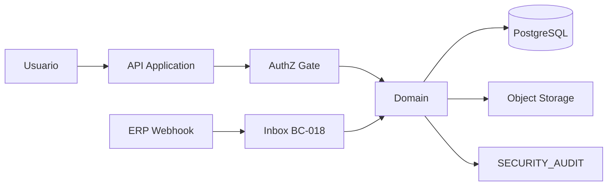

# SEC-DFD-001

| Campo | Valor |
| --- | --- |
| Document ID | Diagramas de fluxo de dados |
| Fluxos | 8 |
| Prompt | 14 |

## DFD-01 — Login (candidato)

```text
User → [IdP] → token → API → validate JWT/session → ACT identity
```

Dados: SEC-AST-001. Boundary TB-06.

## DFD-02 — Registrar solicitação (CMD-001)

```text
User → API → AuthZ → Domain → PG (sr.service_request)
              ↓
         intake PII → SEC-AST-010
```

## DFD-03 — Converter solicitação (CMD-003)

```text
API → AuthZ (SEC-REQ-002) → TX(SR+OS) → PG
```

## DFD-04 — Liberar OS + PO (CMD-005)

```text
API → AuthZ alçada → TX(OS, PO saldo) → PG
              ↓
         SECURITY_AUDIT (DE-004)
```

## DFD-05 — Upload evidência (CMD-016)

```text
User → API → AuthZ → staging storage → TX(evidence_link) → PG
                              ↓
                         malware scan candidato
```

## DFD-06 — Submeter medição → faturar (CMD-017/019)

```text
Executor → API → AuthZ → PG (measurement)
Financeiro → API → AuthZ SoD → PG (billing) — campos custo omitidos se não ROLE
```

## DFD-07 — Registrar nota/pagamento (CMD-020/021)

```text
Integração/User → API → AuthZ FINANCIAL → PG
Webhook ERP → Inbox TB-05 → dedup → CMD-021
```

## DFD-08 — Export relatório sensível

```text
User → API → AuthZ-026 → SECURITY_AUDIT → projeção filtrada → response
```

## Mermaid — visão simplificada



## Dados em trânsito

Todos os DFD assumem TLS em TB-01/TB-03/TB-04 (SEC-REQ-023 candidato).

## Dados em repouso

PG encryption + storage SSE — SEC-REQ-022 candidato; mecanismo TBD infra.
