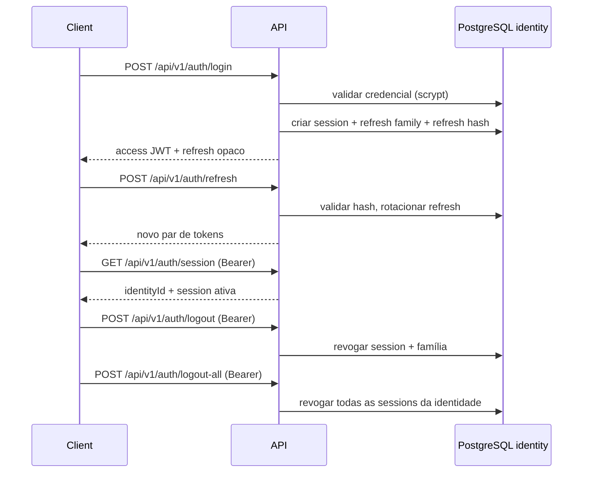

# Prompt 20 — Autenticação backend

Status: implementação técnica (AuthN). Autorização empresarial **fora de escopo**.

## Fluxo



## Rotas (contrato v1)

| Método | Rota | Auth | Descrição |
|--------|------|------|-----------|
| `POST` | `/api/v1/auth/login` | — | Login com credencial |
| `POST` | `/api/v1/auth/refresh` | — | Renovação com refresh opaco |
| `GET` | `/api/v1/auth/session` | Bearer JWT | Sessão atual |
| `POST` | `/api/v1/auth/logout` | Bearer JWT | Encerra sessão atual |
| `POST` | `/api/v1/auth/logout-all` | Bearer JWT | Encerra todas as sessões |

### Login — request

```json
{ "login": "string", "password": "string" }
```

### Login / refresh — response (allowlist)

```json
{
  "accessToken": "string",
  "refreshToken": "string",
  "tokenType": "Bearer",
  "expiresIn": 900,
  "session": { "id": "uuid", "expiresAt": "ISO-8601", "status": "active" }
}
```

### Refresh — request

```json
{ "refreshToken": "string" }
```

### Session — response

```json
{
  "identityId": "uuid",
  "session": { "id": "uuid", "expiresAt": "ISO-8601", "status": "active" }
}
```

### Logout / logout-all — response

```json
{ "success": true }
```

### Erros estáveis

```json
{
  "error": {
    "code": "AUTH_*",
    "message": "string",
    "correlationId": "uuid"
  }
}
```

| Código | HTTP | Quando |
|--------|------|--------|
| `AUTH_INVALID_CREDENTIALS` | 401 | Login inválido (sem enumeração) |
| `AUTH_ACCOUNT_DISABLED` | 403 | Identidade desativada |
| `AUTH_SESSION_EXPIRED` | 401 | Refresh/sessão expirada |
| `AUTH_SESSION_REVOKED` | 401 | Sessão revogada |
| `AUTH_REFRESH_REUSED` | 401 | Reuso de refresh rotacionado |
| `AUTH_UNAUTHORIZED` | 401 | Bearer ausente/inválido |
| `AUTH_VALIDATION_FAILED` | 400 | Payload inválido |
| `AUTH_RATE_LIMITED` | 429 | Abuso de login |

## Decisões de segurança

| Controle | Implementação |
|----------|----------------|
| Hash de senha | scrypt (`hashPassword` / `verifyPasswordHash` — `@cisne/database`) |
| Comparação segura | `timingSafeEqual` no verify scrypt |
| Access token | JWT HS256 curto (default 900s) |
| Refresh | Opaco, SHA-256 persistido, rotação por família (SEC-DEC-002) |
| Token puro | Nunca persistido |
| Enumeração | Mesmo erro para usuário inexistente e senha errada |
| DTO | Allowlist manual; sem `password_hash` / hashes em resposta |
| Abuso login | 5 tentativas/min por IP+User-Agent (in-memory) |
| CORS | `CORS_ORIGIN` configurável |
| CSRF | Bearer JWT (SEC-DEC-004) — sem cookie de auth |
| Query string | Tokens não aceitos em query |
| Logs | Sem senha/token/hash em serializers |
| Correlation ID | Header `X-Correlation-Id`; incluído em erros, não é segredo |

## Variáveis de ambiente

Ver `.env.example`: `JWT_SECRET` (≥32 chars, obrigatório), `JWT_ISSUER`, `JWT_AUDIENCE`, `JWT_ACCESS_TTL_SECONDS`, `JWT_REFRESH_TTL_SECONDS`, `CORS_ORIGIN`, `AUTH_LOGIN_RATE_LIMIT_PER_MINUTE`.

## Comandos de teste

```bash
pnpm db:up
pnpm db:migrate
npx pnpm@9.15.9 lint
npx pnpm@9.15.9 typecheck
npx pnpm@9.15.9 test
npx pnpm@9.15.9 test:integration
npx pnpm@9.15.9 test:e2e
npx pnpm@9.15.9 build
```

## Fora de escopo (Prompt 20)

- Recuperação de senha
- Autorização empresarial / RBAC
- IdP externo
