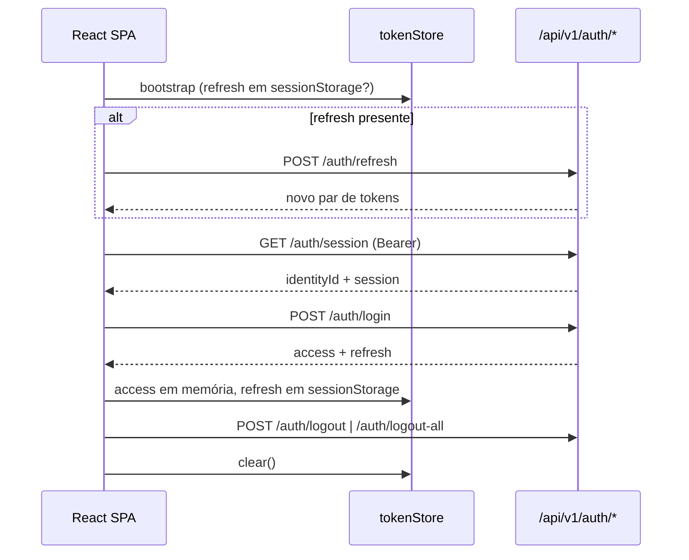

# Prompt 24 — Autenticação e sessão no frontend

Ciclo de autenticação SPA consumindo o contrato real do backend (Prompt 20/21).

## Fluxo



## Rotas técnicas (frontend)

| Rota | Proteção | Descrição |
|------|----------|-----------|
| `/login` | pública | Formulário de login |
| `/app` | `ProtectedRoute` | Shell autenticado mínimo (sem dashboard) |
| `/access-denied` | pública | Conta indisponível (`AUTH_ACCOUNT_DISABLED`) |
| `/unavailable` | pública | Backend indisponível / erro de rede no bootstrap |

Redirecionamento pós-login usa `sanitizeRedirectPath` — apenas paths relativos (`/…`), bloqueando `//` e URLs absolutas.

## Armazenamento de tokens

| Token | Onde | Motivo |
|-------|------|--------|
| Access JWT | **Memória** (`tokenStore`) | SEC-DEC-004 — Bearer SPA, sem cookie de auth |
| Refresh opaco | **sessionStorage** (`cisne.refreshToken`) | Sobrevive ao reload da aba; **não** usa `localStorage` |

`localStorage` **não** é usado para tokens. ADR adotou Bearer JWT, não cookies HttpOnly.

## Segurança

| Controle | Implementação |
|----------|----------------|
| Segredo no bundle | Apenas `VITE_API_BASE_URL` público |
| Credenciais em log | Nenhum `console.log` de senha/token |
| Enumeração | Mensagem única: "Invalid login or password." |
| Open redirect | `sanitizeRedirectPath` |
| CSRF | Bearer header — sem cookie de sessão (SEC-DEC-004) |
| Corrida de refresh | Mutex `refreshInFlight` no `AuthProvider` |
| Cancelamento | `AbortController` no bootstrap |
| Logout | `tokenStore.clear()` + chamada API |
| AuthZ | Frontend não decide permissões finais |

## Componentes

| Arquivo | Responsabilidade |
|---------|------------------|
| `auth/api/auth-api.ts` | Cliente HTTP tipado |
| `auth/storage/token-store.ts` | Memória + sessionStorage |
| `auth/context/AuthProvider.tsx` | Bootstrap, login, logout, refresh |
| `auth/components/ProtectedRoute.tsx` | Guard de rota |
| `pages/LoginPage.tsx` | Formulário acessível |

## Acessibilidade (login)

- `<label htmlFor>` em todos os campos
- `autoComplete="username"` / `current-password`
- `role="alert"` para erros
- `aria-busy` no carregamento
- `aria-invalid` quando há erro de validação

## Testes

| Arquivo | Cobertura |
|---------|-----------|
| `safe-redirect.test.ts` | open redirect |
| `token-store.test.ts` | memória vs sessionStorage |
| `auth-api.test.ts` | mapeamento de erros |
| `LoginPage.test.tsx` | loading, erro, a11y |
| `auth-flow.e2e.test.tsx` | login, proteção, refresh bootstrap, logout, rede |

```bash
npx pnpm@9.15.9 --filter @cisne/web test
npx pnpm@9.15.9 --filter @cisne/web lint
npx pnpm@9.15.9 --filter @cisne/web typecheck
npx pnpm@9.15.9 --filter @cisne/web build
```

## Fora de escopo

- Dashboard ou módulos empresariais
- Autorização contextual (Prompt 23 permanece no backend)
- Prompt 25 não executado
